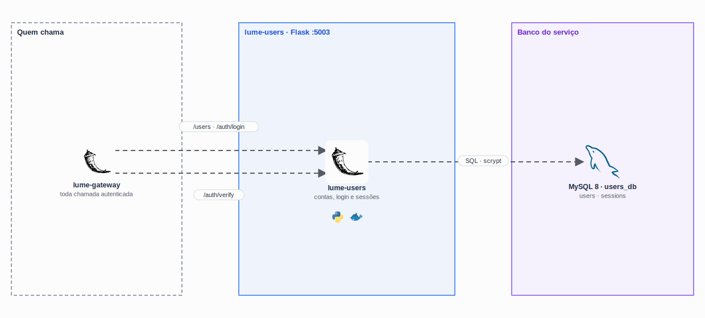

<p align="center">
  
</p>

<h1 align="center">
  Lume Store · Users
</h1>

<p align="center">
  
</p>

<p align="center">
  <a href="https://skillicons.dev">
    
  </a>
</p>

## Qual a finalidade do projeto?

Microserviço de **usuários** da Lume Store: cadastro, login, sessões e perfil. É ele que emite e valida os tokens de sessão usados pelo [lume-gateway](https://github.com/lume-store-org/lume-gateway) para autenticar todas as chamadas da loja, e que define quem é administrador.

Tem o próprio banco MySQL (`users_db`).

## O que foi construído

### Rotas

| Método e rota | Acesso | O que faz |
|---|---|---|
| `POST /users` | público | Cadastro (senha com pelo menos 6 caracteres) |
| `GET /users` | admin | Lista usuários |
| `GET /users/me`, `PUT /users/me` | logado | Ver e editar o próprio perfil |
| `PATCH /users/me/password` | logado | Troca a senha e encerra as outras sessões |
| `GET`, `PUT`, `DELETE /users/<id>` | dono ou admin | Gestão de uma conta |
| `POST /auth/login` | público | Devolve o token de sessão (24 h) |
| `POST /auth/verify` | interno | Usada pelo gateway para validar o token |
| `POST /auth/logout` | logado | Encerra a sessão |
| `GET /health` | interno | Status do serviço e do banco |

### Banco `users_db`

| Tabela | Colunas principais |
|---|---|
| `users` | `name`, `email` (único), `password_hash`, `address`, `phone`, `is_admin`, `created_at` |
| `sessions` | `token`, `user_id`, `expires_at` |

### Segurança

- Senhas com **hash scrypt com salt** (werkzeug), nunca em texto;
- tokens aleatórios de 256 bits (`secrets.token_urlsafe`), com expiração;
- sessões expiradas são limpas a cada login;
- o e-mail e o telefone de um usuário só aparecem para ele mesmo e para o admin.

## Tecnologias utilizadas

- **Python 3.12 + Flask 3 + Gunicorn**;
- **Werkzeug:** hash de senha;
- **MySQL 8** com `mysql-connector-python`;
- **Docker:** imagem sem root, com healthcheck.

## Estrutura do repositório

```text
lume-users/
├── app.py
├── routes.py           # Cadastro, perfil, login e sessões
├── database.py
├── database/init.sql   # Tabelas e contas de teste
├── requirements.txt
└── Dockerfile
```

## Fluxo de funcionamento

1. `POST /auth/login` confere a senha com `check_password_hash` e cria uma sessão.
2. O front envia o token como `Bearer` em toda chamada privada.
3. O gateway chama `POST /auth/verify`, que devolve o usuário e se ele é admin.
4. As rotas deste serviço também conferem os headers `X-User-*`: cada um só acessa a própria conta.

## Variáveis de ambiente

`DB_HOST`, `DB_NAME`, `DB_USER` e `DB_PASSWORD`.

## Como rodar

Pelo [lume-infra](https://github.com/lume-store-org/lume-infra). Contas de teste: `cliente@lumestore.dev` / `senha123` e `admin@lumestore.dev` / `admin123`.

## Como validar a entrega

- login com senha errada devolve `401`;
- `GET /api/users` como cliente devolve `403`, e como admin lista as contas;
- trocar a senha encerra as outras sessões;
- cadastro com e-mail repetido devolve `409`.

## Projeto Lume Store

| Repositório | Camada |
|---|---|
| [lume-front](https://github.com/lume-store-org/lume-front) | Loja (Next.js) |
| [lume-gateway](https://github.com/lume-store-org/lume-gateway) | API Gateway (Flask) |
| [lume-users](https://github.com/lume-store-org/lume-users) | Microserviço de usuários |
| [lume-catalog](https://github.com/lume-store-org/lume-catalog) | Microserviço de catálogo |
| [lume-orders](https://github.com/lume-store-org/lume-orders) | Microserviço de pedidos |
| [lume-infra](https://github.com/lume-store-org/lume-infra) | Docker Compose com a stack completa |

## Autor

**William Alves Coelho** · [@willtechdev](https://github.com/willtechdev)
